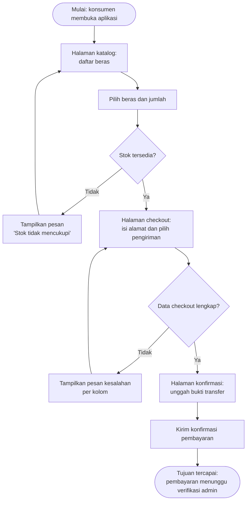

# Dokumen Kebutuhan — Sistem Penjualan Beras BSM

## 1. Deskripsi Aplikasi

**Sistem Penjualan Beras BSM** adalah aplikasi mobile yang membantu konsumen dan karyawan Pabrik BSM dalam proses pemesanan hingga pengiriman beras. Saat ini, pemesanan dilakukan secara manual melalui telepon atau WhatsApp, dicatat di buku, dan bukti transfer dikirim lewat chat sehingga status pesanan sulit dipantau, data rawan hilang, dan karyawan kesulitan mengetahui pesanan yang siap dikirim. Solusi berbentuk aplikasi mobile dipilih karena karakteristik **konteks bergerak** (konsumen memesan dan membayar dari lokasi mana pun, karyawan berpindah antara gudang dan tempat pengantaran) serta **sesi penggunaan singkat** (memeriksa status, mengunggah bukti transfer, atau memasukkan nomor resi hanya membutuhkan beberapa menit).

## 2. User Persona

### Persona 1 — Rani — Konsumen Rumah Tangga

| Komponen              | Isi                                                                                                                                 |
| :-------------------- | :---------------------------------------------------------------------------------------------------------------------------------- |
| Nama dan peran        | Rani — konsumen rumah tangga yang membeli beras untuk kebutuhan keluarga                                                            |
| Tujuan                | Memesan beras berkualitas dengan harga jelas tanpa harus datang ke pabrik atau menunggu balasan chat yang lama                      |
| Kendala               | Jadwal kerja padat sehingga hanya bisa memesan di sela waktu istirahat; tidak tahu apakah stok beras yang diinginkan masih tersedia |
| Perangkat dan konteks | Ponsel Android, biasanya digunakan pada malam hari atau saat jam istirahat kerja                                                    |
| Frekuensi penggunaan  | 1–2 kali per bulan, biasanya saat stok beras di rumah mulai menipis                                                                 |

### Persona 2 — Budi — Karyawan Pengiriman

| Komponen              | Isi                                                                                                               |
| :-------------------- | :---------------------------------------------------------------------------------------------------------------- |
| Nama dan peran        | Budi — karyawan yang bertugas menyiapkan dan mengirim pesanan beras                                               |
| Tujuan                | Mengetahui daftar pesanan yang siap dikirim dan mencatat nomor resi agar konsumen dapat melacak pesanannya        |
| Kendala               | Informasi pesanan tersebar di chat dan buku catatan, sehingga sering ada pesanan yang terlewat atau dikirim ganda |
| Perangkat dan konteks | Ponsel Android, digunakan di gudang dan saat berada di jalan untuk mengantar pesanan                              |
| Frekuensi penggunaan  | Setiap hari kerja, 3–5 kali per hari                                                                              |

## 3. Kebutuhan Fungsional

| ID   | Rumusan Kebutuhan                                                                                                                             | Terkait Persona |
| :--- | :-------------------------------------------------------------------------------------------------------------------------------------------- | :-------------- |
| F-01 | Konsumen dapat melihat daftar beras beserta kualitas, harga per kilogram, dan status ketersediaan stok                                        | Rani            |
| F-02 | Konsumen dapat menambahkan beras ke keranjang dengan menentukan jumlah kilogram yang dipesan                                                  | Rani            |
| F-03 | Konsumen dapat melakukan checkout dengan mengisi alamat pengiriman dan memilih metode pengiriman                                              | Rani            |
| F-04 | Konsumen dapat melihat total harga pesanan termasuk ongkos kirim sebelum melakukan konfirmasi                                                 | Rani            |
| F-05 | Konsumen dapat mengonfirmasi pembayaran dengan mengunggah bukti transfer dan mengisi detail pembayaran                                        | Rani            |
| F-06 | Konsumen dapat melihat status pesanan (Menunggu Pembayaran, Menunggu Verifikasi, Terverifikasi, Sedang Dikirim, Selesai) pada halaman riwayat | Rani            |
| F-07 | Karyawan dapat melihat daftar pesanan yang sudah terverifikasi dan siap dikirim                                                               | Budi            |
| F-08 | Karyawan dapat memasukkan nomor resi dan memperbarui status pengiriman pesanan                                                                | Budi            |
| F-09 | Konsumen dan Karyawan dapat login menggunakan akun sesuai peran masing-masing                                                                 | Rani, Budi      |

## 4. Kebutuhan Nonfungsional

| ID    | Kategori | Rumusan                                                               | Kriteria Terukur                                                                                      |
| :---- | :------- | :-------------------------------------------------------------------- | :---------------------------------------------------------------------------------------------------- |
| NF-01 | Kegunaan | Proses pemesanan beras selesai dengan langkah yang ringkas            | Konsumen menyelesaikan pemesanan maksimal 6 langkah dari halaman katalog hingga konfirmasi pembayaran |
| NF-02 | Kinerja  | Daftar beras pada halaman katalog tampil tanpa menunggu lama          | Daftar beras tampil kurang dari 3 detik pada jaringan 4G                                              |
| NF-03 | Keamanan | Data pesanan hanya dapat diakses oleh pemiliknya dan karyawan terkait | Halaman riwayat pesanan hanya menampilkan pesanan milik konsumen yang sedang login                    |

## 5. Prioritas Fitur (MoSCoW)

| Prioritas             | ID Kebutuhan                 | Alasan                                                                                                                                                                                             |
| :-------------------- | :--------------------------- | :------------------------------------------------------------------------------------------------------------------------------------------------------------------------------------------------- |
| Must have             | F-01, F-02, F-03, F-05, F-08 | Lima fitur ini adalah inti alur bisnis: konsumen harus bisa melihat produk, memesan, membayar, dan karyawan harus bisa mencatat resi. Tanpa kelimanya, aplikasi tidak menyelesaikan masalah utama. |
| Should have           | F-04, F-06, F-07             | Penting untuk pengalaman pengguna dan transparansi, tetapi bisa ditunda sementara dengan konfirmasi manual via chat jika waktu implementasi terbatas.                                              |
| Could have            | F-09                         | Login multi-peran dapat disederhanakan sementara dengan pemilihan peran di awal sesi; ditingkatkan bila waktu memungkinkan.                                                                        |
| Won't have (saat ini) | —                            | Tidak ada fitur yang secara sengaja ditiadakan pada semester ini; seluruh kebutuhan direncanakan untuk diimplementasikan bertahap.                                                                 |

## 6. User Flow

Alur utama: **Konsumen memesan beras hingga konfirmasi pembayaran terkirim.**

## 7. Pemetaan Kebutuhan ke Antarmuka

| ID Kebutuhan | Rumusan (ringkas)                   | Prioritas | Halaman yang Memenuhi                | Widget yang Direncanakan (P3)                           |
| :----------- | :---------------------------------- | :-------- | :----------------------------------- | :------------------------------------------------------ |
| F-01         | Melihat daftar beras                | Must      | Halaman katalog                      | `Scaffold` + `AppBar` + `ListView.builder` + `ListTile` |
| F-02         | Menambah beras ke keranjang         | Must      | Halaman detail beras                 | `Scaffold` + `Column` + `Row` + tombol                  |
| F-03         | Checkout dengan alamat & pengiriman | Must      | Halaman checkout                     | `Scaffold` + `Column` (form) + `Padding`                |
| F-04         | Melihat total harga & ongkir        | Should    | Halaman checkout (ringkasan)         | `Card` + `Column` + `Text`                              |
| F-05         | Konfirmasi pembayaran               | Must      | Halaman konfirmasi pembayaran        | `Scaffold` + `Column` + tombol unggah                   |
| F-06         | Melihat status pesanan              | Should    | Halaman riwayat pesanan              | `ListView.builder` + `ListTile` + `Text` warna status   |
| F-07         | Melihat daftar pesanan siap kirim   | Should    | Halaman daftar pengiriman (karyawan) | `ListView.builder` + `ListTile`                         |
| F-08         | Input nomor resi & update status    | Must      | Halaman detail pengiriman            | `Scaffold` + `Column` + `TextField` (P6)                |
| F-09         | Login sesuai peran                  | Could     | Halaman login                        | `Scaffold` + `Column` + form (P6)                       |

## 8. Refleksi

Bagian analisis yang paling sulit saya tetapkan adalah **rumusan kebutuhan fungsional**, karena saya harus memastikan setiap pernyataan hanya memuat satu fungsi dan tidak menyebut teknologi implementasi. Saya beberapa kali tergoda menuliskan "aplikasi menggunakan REST API" padahal itu adalah keputusan implementasi, bukan kebutuhan pengguna. Selain itu, menentukan prioritas MoSCoW juga menantang karena saya harus realistis membatasi Must have maksimal lima fitur agar MVP dapat diselesaikan sesuai jadwal.