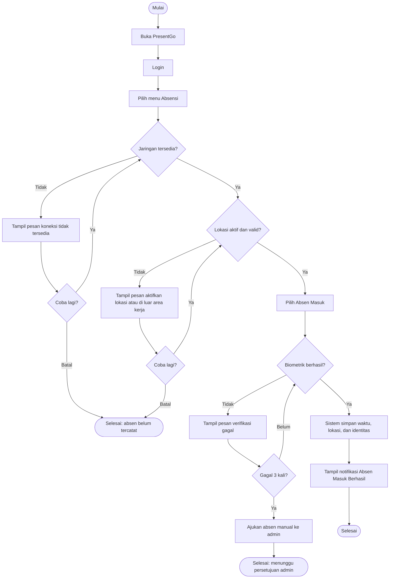

# Dokumen Kebutuhan dan User Flow: PresentGo

## 1. Deskripsi Aplikasi

**PresentGo** adalah aplikasi mobile absensi untuk karyawan PT Kencana Makmur Lestari. Pencatatan kehadiran yang manual atau tidak seragam menyulitkan karyawan membuktikan kehadirannya dan memperlambat HRD saat merekap. Bentuk aplikasi mobile dipilih karena karyawan selalu membawa ponsel dan absen terjadi di lokasi kerja pada waktu yang berbeda-beda, sehingga verifikasi lokasi dan identitas harus bisa dilakukan saat itu juga dari perangkat di tangan.

## 2. User Persona

### Persona 1: Karyawan

| Komponen | Isi |
|---|---|
| Nama dan peran | Karyawan (pengguna utama, mencatat kehadiran harian) |
| Tujuan | Mencatat absen masuk tepat waktu dengan bukti yang sah |
| Kendala | Sinyal tidak stabil di area kerja, lokasi sering tidak aktif, biometrik kadang gagal terbaca |
| Perangkat dan konteks | Ponsel Android pribadi, dipakai di area kerja pada jam masuk, sering dalam kondisi terburu-buru |
| Frekuensi penggunaan | Sekali per hari kerja untuk absen masuk, ditambah sesekali melihat riwayat |

### Persona 2: Admin HRD

| Komponen | Isi |
|---|---|
| Nama dan peran | Admin HRD (memantau kehadiran dan menyelesaikan pengajuan absen manual) |
| Tujuan | Memastikan data kehadiran akurat dan memproses absen yang gagal secara sah |
| Kendala | Pengajuan absen manual sulit diverifikasi alasannya, rekap periodik memakan waktu |
| Perangkat dan konteks | Ponsel atau tablet kantor, dipakai selama jam kerja |
| Frekuensi penggunaan | Beberapa kali sehari untuk pengajuan, sekali per periode untuk rekap |

## 3. Kebutuhan Fungsional

| No | Kebutuhan | Cara verifikasi |
|---|---|---|
| F-01 | Karyawan dapat masuk ke akun menggunakan kredensial yang terdaftar | Kredensial benar membuka beranda; kredensial salah menampilkan pesan gagal |
| F-02 | Karyawan dapat melakukan absen masuk setelah lokasi terverifikasi berada di area kerja | Absen ditolak di luar area kerja dan diterima di dalam area kerja |
| F-03 | Karyawan dapat memverifikasi identitas dengan biometrik sebelum absen tersimpan | Biometrik valid menyimpan absen; biometrik tidak valid tidak menyimpan |
| F-04 | Karyawan dapat melihat notifikasi hasil absen (berhasil atau gagal) setelah proses selesai | Notifikasi muncul dengan status yang sesuai hasil proses |
| F-05 | Karyawan dapat melihat riwayat kehadiran pribadi | Daftar memuat tanggal, jam, dan status setiap absen |
| F-06 | Karyawan dapat mengajukan absen manual setelah verifikasi biometrik gagal 3 kali | Pengajuan terkirim dan berstatus menunggu |
| F-07 | Admin dapat menanggapi pengajuan absen manual dengan keputusan setuju atau tolak | Status pengajuan berubah sesuai keputusan dan terlihat oleh karyawan |
| F-08 | Admin dapat melihat rekap kehadiran karyawan per periode | Rekap sesuai data absen pada periode yang dipilih |

## 4. Kebutuhan Nonfungsional

| No | Kategori | Kebutuhan | Kriteria terukur |
|---|---|---|---|
| NF-01 | Kinerja | Proses absen masuk selesai cepat | Dari penekanan tombol Absen Masuk sampai notifikasi berhasil muncul maksimal 5 detik pada jaringan 4G |
| NF-02 | Kompatibilitas | Aplikasi berjalan pada perangkat target | Berjalan pada Android versi minimum yang ditetapkan (isi versi) dan menolak absen bila biometrik perangkat tidak tersedia |

## 5. Prioritas MoSCoW

| Kategori | Kebutuhan | Alasan |
|---|---|---|
| Must have | F-01, F-02, F-03, F-04, F-06 | Membentuk alur utama absen masuk Karyawan. F-06 dimasukkan agar karyawan tetap bisa mencatat kehadiran ketika biometrik gagal |
| Should have | F-05, F-07 | F-07 menuntaskan jalur pengajuan F-06 bagi Admin HRD; F-05 menumbuhkan kepercayaan Karyawan pada data absennya, tetapi alur absen tetap berjalan tanpanya |
| Could have | F-08 | Rekap membantu Admin HRD, tetapi bisa menyusul setelah alur absen stabil |
| Won't have (kali ini) | Absen pulang, lembur, cuti | Di luar cakupan alur utama Tugas 4; ditunda agar fokus pada absen masuk dan dapat ditambahkan pada iterasi berikutnya |

## 6. User Flow

**Tujuan pengguna:** Karyawan melakukan absen masuk.

Asumsi: pengguna sudah memiliki akun karyawan yang terdaftar.

## 7. Pemetaan Kebutuhan ke Antarmuka

> Kolom widget masih rencana awal 

| Kebutuhan | Halaman | Widget yang direncanakan |
|---|---|---|
| F-01 | Halaman Login | Scaffold, Column, TextField (2), ElevatedButton |
| F-02 | Halaman Absensi | Scaffold, Card, Text (status lokasi), ElevatedButton (Absen Masuk) |
| F-03 | Halaman Absensi (dialog verifikasi) | AlertDialog, Icon, TextButton (coba lagi) |
| F-04 | Halaman Absensi | SnackBar atau AlertDialog, Text, Icon |
| F-05 | Halaman Riwayat | ListView, ListTile, Card |
| F-06 | Halaman Pengajuan Absen Manual | Form, TextField (alasan), ElevatedButton |
| F-07 | Halaman Daftar Pengajuan (Admin) | ListView, ListTile, ElevatedButton (Setuju, Tolak) |
| F-08 | Halaman Rekap (Admin) | ListView atau DataTable, DropdownButton (periode) |

## 8. Refleksi

Pada user flow absen masuk, saya awalnya hanya menggambar cabang gagal untuk jaringan dan biometrik, lalu sadar keputusan lokasi juga butuh cabang gagal agar semua keputusan bisa ditelusuri. Menentukan Must have paling sulit karena F-06 (absen manual) bergantung pada F-07 (persetujuan admin) yang saya taruh di Should have, sehingga alasannya harus saya tulis eksplisit. Pada Pertemuan 5 saya akan menguji apakah widget di tabel pemetaan benar-benar mendukung jalur gagal biometrik pada F-03.
