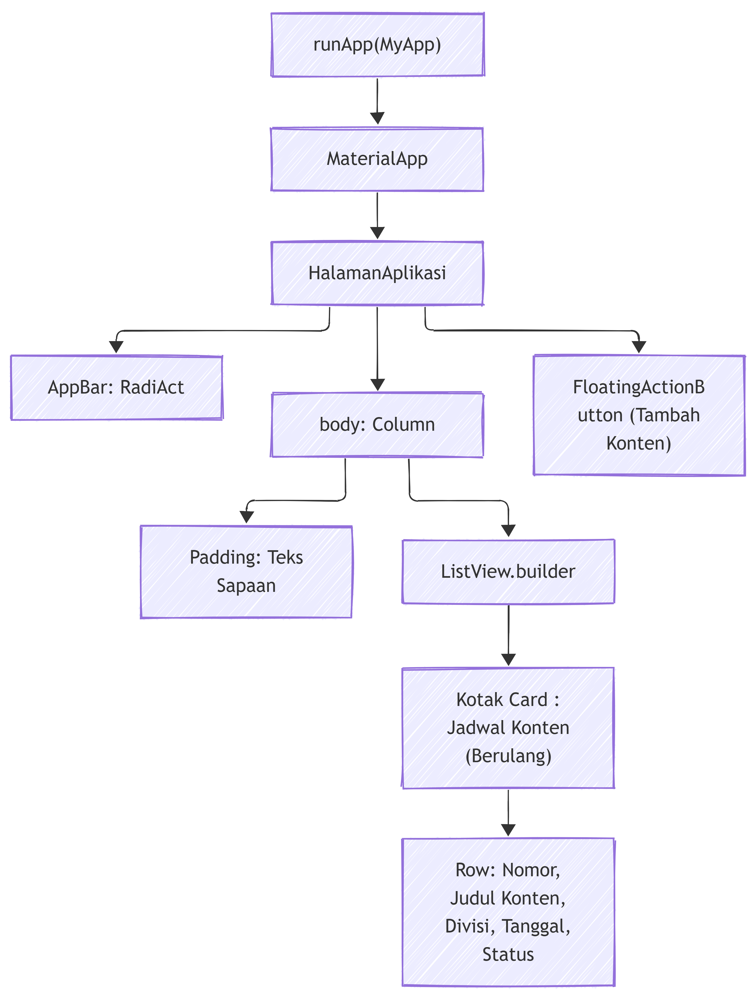

# Tugas 3: Halaman Aplikasi Sederhana

**Nama**  : Deyna Angeliawati Zahara  
**NPM**   : 230660221032  
**Kelas** : SI VII B  

## 1. Tentang Aplikasi
### Domain yang dipilih
Manajemen Program Kerja Harian (Media/Konten) UKM Unsap Radio - RADIACT

---
### Nama Aplikasi
RadiAct (Radio Activity)

---
### Deskripsi Singkat Aplikasi
Aplikasi manajemen jadwal program harian/upload konten digital untuk UKM Unsap Radio. Aplikasi ini memudahkan crew dalam memantau realisasi program.

---
### Deskripsi Singkat Hal Utama Apk
Halaman utama aplikasi RadiAct ini dirancang sebagai antarmuka utama untuk mengelola serta memantau jadwal upload konten harian UKM Unsap Radio. Halaman ini menyajikan ucapan sapaan kepada tim kreatif di bagian atas, diikuti oleh daftar program radio yang dilengkapi dengan informasi nomor urut, nama konten, divisi penanggung jawab, tanggal publikasi, serta indikator status tayang secara terstruktur. Selain itu, terdapat navigasi bilah atas untuk identitas aplikasi dan tombol aksi melayang di pojok kanan bawah yang memudahkan pengguna dalam menambahkan jadwal konten baru.

## 2. Widget Tree


---
### Hasil
[screenshot-halaman.png](screenshot-halaman.png)

## 3. Refleksi
Bagian layout yang paling sulit dirangkai adalah saat menyusun kombinasi widget ListView.builder dan Row. Hal ini sangat menantang karena terdapat banyak istilah serta sintaks penulisan yang sangat sensitif, sehingga apabila ada kesalahan kecil saja bisa langsung berdampak pada jalannya aplikasi. Namun, setelah dipelajari dan dicoba secara bertahap satu persatu, tata letak antarmuka akhirnya dapat terstruktur dengan rapi dan berjalan tanpa kendala.

## 4. Struktur Pengumpulan Folder
```text
tugas3_Deyna/
├── halaman_aplikasi.dart        # Kode sumber utama aplikasi.
├── widget-tree.png              # Diagram alur dan struktur hirarki widget aplikasi.
├── screenshot-halaman.png       # Tangkapan layar tampilan aplikasi di browser/layar.
└── README.md                    # Dokumentasi dan ringkasan tugas.
```