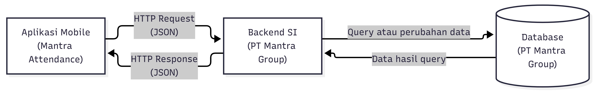
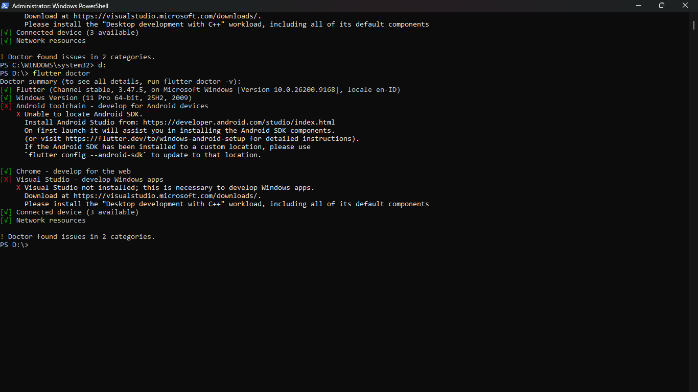
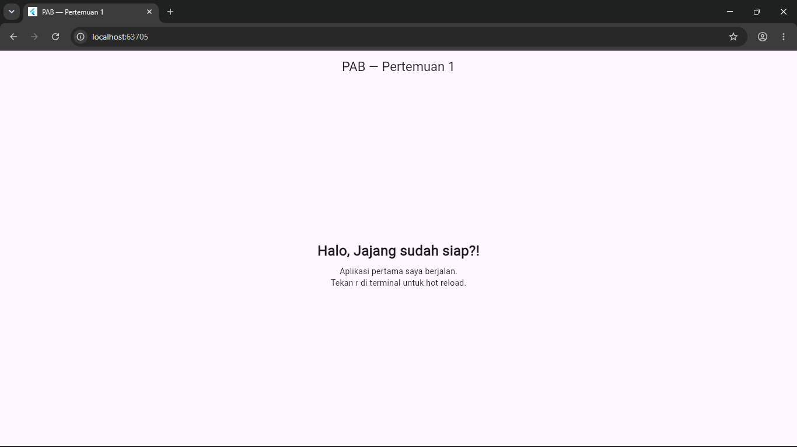

# Tugas 1 — Identifikasi Kebutuhan Aplikasi Bergerak

**Nama:** [ Jajang Komara]
**NIM:** [230660221102]
**Mata Kuliah:** Pemrograman Aplikasi Bergerak
**Domain:** Sistem Absensi Karyawan PT Mantra Group

---

## 1. Deskripsi Sistem

**Mantra Attendance** merupakan aplikasi mobile yang dirancang untuk membantu proses pencatatan kehadiran karyawan PT Mantra Group, perusahaan yang bergerak di bidang real estate dan perumahan. Pengguna utama aplikasi adalah karyawan yang melakukan proses check-in dan check-out serta melihat riwayat kehadiran, sedangkan pengelolaan data karyawan, data kehadiran, dan rekap absensi dilakukan melalui backend sistem informasi oleh pihak yang memiliki kewenangan. Permasalahan yang ingin ditangani adalah kebutuhan akan proses pencatatan kehadiran yang praktis bagi karyawan serta tersedianya data kehadiran yang terstruktur dan terintegrasi bagi perusahaan. Aplikasi mobile dipilih karena karyawan dapat membawa perangkatnya ketika melakukan aktivitas pekerjaan di berbagai lokasi sehingga sesuai dengan karakteristik **konteks bergerak**, sedangkan proses check-in dan check-out merupakan **sesi penggunaan singkat** yang dapat dilakukan melalui beberapa interaksi sentuh.

---

## 2. Diagram Arsitektur

Arsitektur sistem menggunakan pola komunikasi antara aplikasi mobile, backend sistem informasi, dan database. Aplikasi mobile mengirimkan HTTP Request kepada backend untuk melakukan autentikasi, check-in, check-out, dan mengambil riwayat absensi. Backend kemudian berkomunikasi dengan database untuk membaca atau menyimpan data dan mengirimkan HTTP Response kembali kepada aplikasi mobile.



### Alur komunikasi

```text
Aplikasi Mobile
      │
      │ HTTP Request
      │
      ▼
Backend SI PT Mantra Group
      │
      │ Query / Update
      ▼
Database PT Mantra Group
      │
      │ Data
      ▼
Backend SI PT Mantra Group
      │
      │ HTTP Response
      ▼
Aplikasi Mobile
```

File sumber diagram tersedia pada:

`diagram.mmd`

---

## 3. Tabel Kebutuhan

| No. | Permintaan                                                                                                                                | Pengguna              | Karakteristik Mobile yang Terkait              | Fitur Aplikasi                                                                           | Materi Pemenuh                      |
| --: | ----------------------------------------------------------------------------------------------------------------------------------------- | --------------------- | ---------------------------------------------- | ---------------------------------------------------------------------------------------- | ----------------------------------- |
|   1 | Karyawan ingin masuk ke aplikasi menggunakan akun perusahaan agar identitas pengguna dapat dikenali sebelum melakukan absensi.            | Karyawan              | Sesi penggunaan singkat, konektivitas terbatas | Halaman login, input username/email dan password, validasi input, penyimpanan sesi login | UI/UX & Validasi                    |
|   2 | Karyawan ingin mengetahui status kehadirannya pada hari berjalan agar dapat memastikan proses absensi telah tercatat.                     | Karyawan              | Sesi penggunaan singkat, layar kecil           | Dashboard, status kehadiran, informasi waktu check-in dan check-out                      | UI/UX & Navigasi                    |
|   3 | Karyawan ingin melakukan check-in melalui ponsel ketika memulai aktivitas kerja.                                                          | Karyawan              | Konteks bergerak, interaksi sentuh             | Tombol check-in, konfirmasi, pencatatan waktu, pengiriman data ke backend                | Navigasi & REST API                 |
|   4 | Karyawan ingin melakukan check-out melalui ponsel ketika mengakhiri aktivitas kerja.                                                      | Karyawan              | Konteks bergerak, interaksi sentuh             | Tombol check-out, konfirmasi, pencatatan waktu, pengiriman data ke backend               | Navigasi & REST API                 |
|   5 | Karyawan ingin melihat riwayat kehadiran untuk mengetahui catatan absensinya pada hari-hari sebelumnya.                                   | Karyawan              | Layar kecil, sesi penggunaan singkat           | Halaman riwayat, daftar tanggal, waktu check-in dan check-out, status kehadiran          | Data & REST API                     |
|   6 | Karyawan ingin memperoleh informasi bahwa proses check-in atau check-out berhasil atau gagal agar dapat mengetahui status pencatatannya.  | Karyawan              | Sesi penggunaan singkat, konektivitas terbatas | Pesan konfirmasi, indikator status, validasi respons dari server                         | REST API & Validasi                 |
|   7 | Karyawan ingin tetap dapat melihat data absensi yang sebelumnya telah diterima aplikasi ketika koneksi internet sementara tidak tersedia. | Karyawan              | Konektivitas terbatas                          | Penyimpanan atau cache data absensi tertentu secara lokal                                | Data Lokal                          |
|   8 | Admin atau pihak yang berwenang ingin mengelola data karyawan, memproses data kehadiran, dan menghasilkan rekap absensi perusahaan.       | Admin/Pihak Berwenang | —                                              | **Di luar lingkup aplikasi mobile (Backend SI)**                                         | Backend SI / Di luar lingkup mobile |

---

## 4. Bukti Environment Siap

Bukti environment Flutter disediakan dalam folder `flutter-doctor/`.

### 4.1 Sebelum Perbaikan

Hasil `flutter doctor -v` sebelum environment Android diperbaiki.



Pada tahap awal, Flutter telah terpasang dan dapat dijalankan, tetapi Android toolchain belum dapat digunakan karena Android SDK belum terdeteksi.

### 4.2 Sesudah Perbaikan

Hasil `flutter doctor -v` setelah environment yang diperlukan untuk pengembangan aplikasi mobile disiapkan.


### 4.3 Aplikasi Counter

Bukti aplikasi Flutter berhasil dijalankan pada target yang digunakan.



---

## 5. Refleksi

Fitur perangkat yang paling relevan untuk aplikasi Mantra Attendance adalah **lokasi**, karena informasi lokasi dapat digunakan untuk mendukung pencatatan dan validasi tempat karyawan melakukan absensi. Fitur tersebut relevan dengan karakteristik **konteks bergerak**, terutama karena aktivitas kerja pada perusahaan real estate dapat berkaitan dengan lebih dari satu lokasi pekerjaan. Pemanfaatan lokasi dapat dikombinasikan dengan waktu dan identitas karyawan sehingga data absensi yang dikirimkan ke backend memiliki informasi pendukung yang lebih lengkap.
